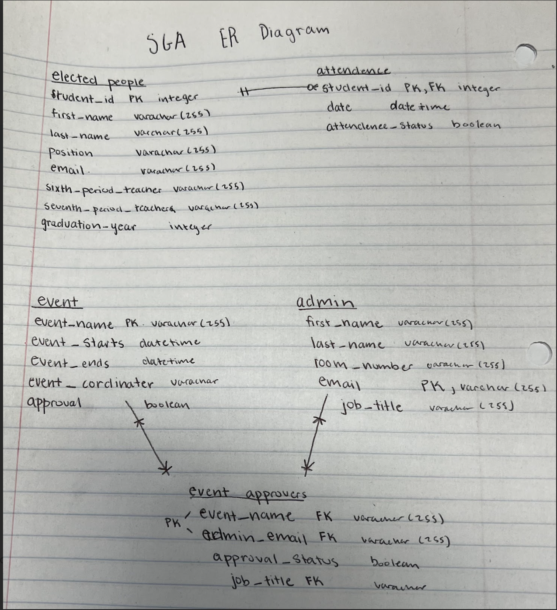

## ER Diagram by hand

## Create table script

CREATE SCHEMA SGA IF DOES NOT EXIST;

DROP VIEW IF EXISTS SGA.attendance_summary_view; DROP VIEW IF EXISTS SGA.event_approval_status_view;

DROP TABLE IF EXISTS SGA.event_approvers CASCADE; DROP TABLE IF EXISTS SGA.attendance CASCADE; DROP TABLE IF EXISTS SGA.event CASCADE; DROP TABLE IF EXISTS SGA.admin CASCADE; DROP TABLE IF EXISTS SGA.students CASCADE;

CREATE TABLE SGA.students ( student_id INTEGER PRIMARY KEY, first_name VARCHAR(255), last_name VARCHAR(255), position VARCHAR(255), graduation_year INTEGER, email VARCHAR(255), sixth_period_teacher VARCHAR(255), seventh_period_teacher VARCHAR(255) );

CREATE TABLE SGA.attendance ( attendance_id SERIAL PRIMARY KEY, student_id INTEGER, date TIMESTAMP, attendance_status BOOLEAN, FOREIGN KEY (student_id) REFERENCES SGA.students(student_id) ON DELETE CASCADE );

CREATE TABLE SGA.event ( event_name VARCHAR(255) PRIMARY KEY, event_starts TIMESTAMP, event_ends TIMESTAMP, event_coordinator VARCHAR(255), approval BOOLEAN );

CREATE TABLE SGA.admin ( email VARCHAR(255) PRIMARY KEY, first_name VARCHAR(255), last_name VARCHAR(255), job_title VARCHAR(255), room_number VARCHAR(255) );

CREATE TABLE SGA.event_approvers ( event_name VARCHAR(255), admin_email VARCHAR(255), individual_approval_status BOOLEAN, PRIMARY KEY (event_name, admin_email), FOREIGN KEY (event_name) REFERENCES SGA.event(event_name) ON DELETE CASCADE, FOREIGN KEY (admin_email) REFERENCES SGA.admin(email) ON DELETE CASCADE );

### models.py file 
[Models.py file](orm/db/models.py)

### ER Diagram by django

