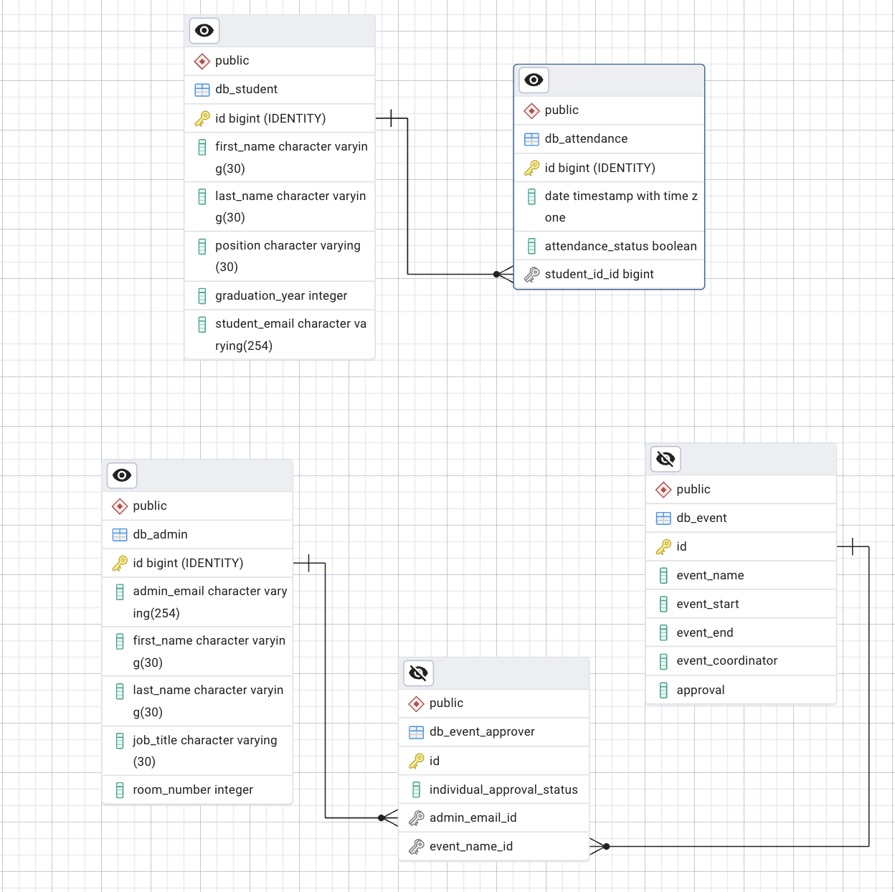

## Project Summary
The goal of this project was to compare making a database I made as a final for the last semester with the Django version. First by comparing the ER Diagrams produced from both methods, the orgonail project and the django project, and noticing the differences between the models. Next is comparing the code produced by both methods and then finally reflecting on each method.

## ER Diagram by hand

## Create table script

CREATE SCHEMA SGA IF DOES NOT EXIST;

DROP VIEW IF EXISTS SGA.attendance_summary_view; DROP VIEW IF EXISTS SGA.event_approval_status_view;

DROP TABLE IF EXISTS SGA.event_approvers CASCADE; DROP TABLE IF EXISTS SGA.attendance CASCADE; DROP TABLE IF EXISTS SGA.event CASCADE; DROP TABLE IF EXISTS SGA.admin CASCADE; DROP TABLE IF EXISTS SGA.students CASCADE;

CREATE TABLE SGA.students ( student_id INTEGER PRIMARY KEY, first_name VARCHAR(255), last_name VARCHAR(255), position VARCHAR(255), graduation_year INTEGER, email VARCHAR(255), sixth_period_teacher VARCHAR(255), seventh_period_teacher VARCHAR(255) );

CREATE TABLE SGA.attendance ( attendance_id SERIAL PRIMARY KEY, student_id INTEGER, date TIMESTAMP, attendance_status BOOLEAN, FOREIGN KEY (student_id) REFERENCES SGA.students(student_id) ON DELETE CASCADE );

CREATE TABLE SGA.event ( event_name VARCHAR(255) PRIMARY KEY, event_starts TIMESTAMP, event_ends TIMESTAMP, event_coordinator VARCHAR(255), approval BOOLEAN );

CREATE TABLE SGA.admin ( email VARCHAR(255) PRIMARY KEY, first_name VARCHAR(255), last_name VARCHAR(255), job_title VARCHAR(255), room_number VARCHAR(255) );

CREATE TABLE SGA.event_approvers ( event_name VARCHAR(255), admin_email VARCHAR(255), individual_approval_status BOOLEAN, PRIMARY KEY (event_name, admin_email), FOREIGN KEY (event_name) REFERENCES SGA.event(event_name) ON DELETE CASCADE, FOREIGN KEY (admin_email) REFERENCES SGA.admin(email) ON DELETE CASCADE );

### models.py file 
[Models.py file](sga_project.py)
 
### ER Diagram by django

### Reflection 
There are some differences between the handmade ER diagram and the one django produced. The first difference that I noticed was that attendance id was automatically generated in the django table when the id of the table should have been the student_id foreign key. In the handmade ER diagram I was able to say that a foreign key was also a primary key but I wasn’t able to do that in django. The other thing I noticed was that the crows feet notion between the two ER diagrams are different and I wonder if that has to do with the fact that django gives every table an id automatically or maybe I had a human error when drawing my ER diagram by hand. The last difference I noticed was that my event_approvers join table was not able to have a primary key of admin_email and event_name which were both foreign keys. In my handmade table I was able to do a double primary key and foreign keys be my primary key. Django was definitely cleaner and more organized as long as you are able to understand it. Personally it took me some time to make sense of the ER diagram’s symbols and data types but it is most likely because I understand the handmade one better because I made it myself. I don’t think there is much difference in the appearance of the two tables but I worry about the crow's feet notation as it represents the relationship between tables.

In terms of effort I think django has a little bit of a learning curve that makes it slower doing it for the first time but if I were to do this again I think it would be faster than doing it by hand. Personally I prefer doing it by hand because that's how I first learned it and it helps me understand the tables and their connections better but for the sake of efficiency I think django is helpful. If I was given the option I would definitely choose to do it by hand but I recognize that django would be faster and cleaner. I still do have some reservations about the automatic id columns in django but I am sure that is easy to fix. 

I preferred django for the coding part because it makes more sense to me and it looks like the code I am used to which is classes. Writing Django is more simple and less tedious to edit if/when you make a mistake. Overall I would rather make an ER Diagram by hand and use django to create the database.